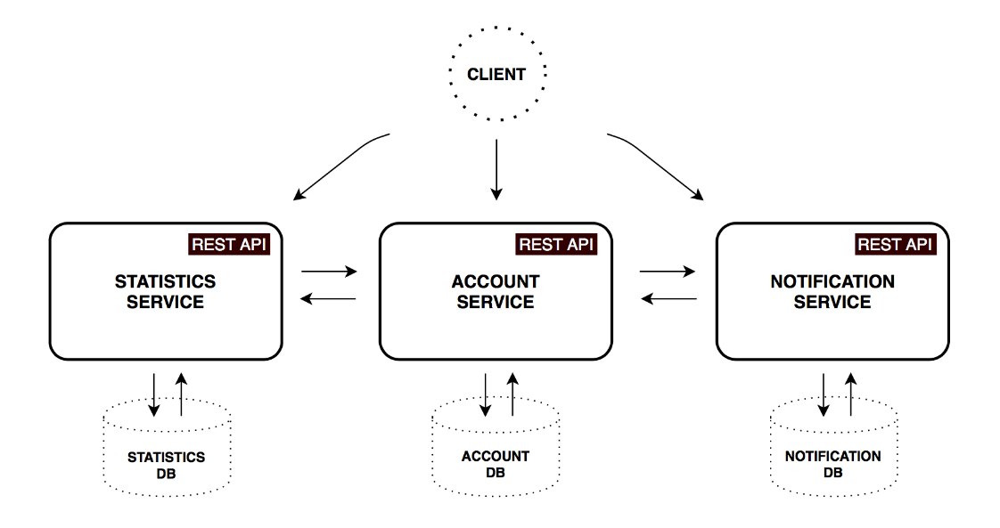

# Piggy Metrics

> <https://github.com/sqshq/PiggyMetrics>

**Size of the project:** ~5,000 SLoC

## Description

Piggy Metrics supports you in creating and managing your own personal piggy bank. It provides statistics about your personal finances, spendings, and savings. The API Gateway is based on Netflix's Zuul and bundles the communication between front- and backend (no direct requests made from client to backend services).
Another architecture pattern used is "Service discovery" - in this project realized with Netflix Eureka for automatic detection of network locations.
Furthermore Ribbon is used as a client-side load balancer and with Hystrix, this project also uses the "Circuit Breaker" pattern to manage the occuring of failures from dependencies accessed over the network.

## Services

-	[Statistics Service](https://github.com/sqshq/piggymetrics/tree/master/statistics-service) (Java, Spring Boot)

-	[Account Service](https://github.com/sqshq/piggymetrics/tree/master/account-service) (Java, Spring Boot)

-	[Notification Service](https://github.com/sqshq/piggymetrics/tree/master/notification-service) (Java, Spring Boot)

## Architecture
