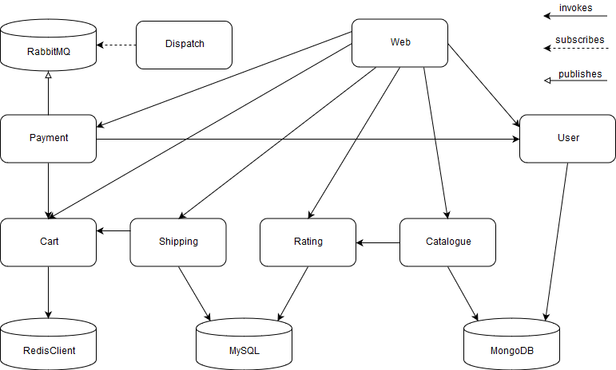

# Robot Shop

> <https://github.com/instana/robot-shop>

**Size of the project:** ~2,300 SLoC

## Description

Robot Shop is an example for a typical online shop. It uses 5 different programming languages and is structured into individually deployable Microservices. The whole system can be deployed using Docker, including the different databases.

## Services
- [Catalogue](https://github.com/instana/robot-shop/tree/master/catalogue) (Node.js)

- [User](https://github.com/instana/robot-shop/blob/master/user/server.js) (Node.js)

- [Cart](https://github.com/instana/robot-shop/tree/master/cart) (Node.js)

- [Shipping](https://github.com/instana/robot-shop/tree/master/shipping) (Java)

- [Ratings](https://github.com/instana/robot-shop/tree/master/ratings) (PHP)

- [Payment](https://github.com/instana/robot-shop/tree/master/payment) (Python)

- [Dispatch](https://github.com/instana/robot-shop/tree/master/dispatch) (Go)

- [Web UI](https://github.com/instana/robot-shop/tree/master/web) (Angular.js)
Service that hosts the website.

## Architecture
