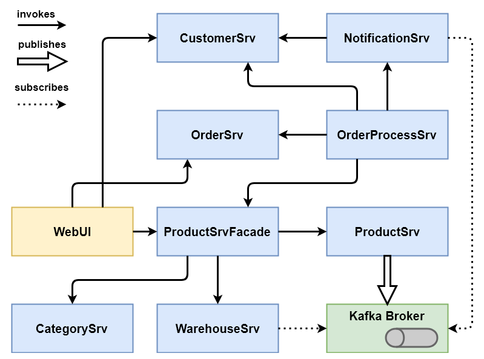

# Service-based Web Shop v2

> <https://github.com/xJREB/service-based-web-shop-v2>

**Size of the project:** ~3,200 SLoC

## Description

This app emulates a simple WebShop system and contains 8 backend services and one frontend service that provides read access to most of the other services resources. The services are implemented in Java with the help of the the Dropwizard framework and are using REST for the communication. This project was part of a controlled experiment, so you can ignore everything related to e.g. exercises. Compared to [version 1](service-based-web-shop-v1), this version relies on certain service-based patterns and has been extended with two services, namely OrderProcess and ProductFacade. Furthermore, the system now includes Kafka as a message broker.

## Services
- [WebUI](https://github.com/xJREB/service-based-web-shop-v2/tree/master/src/WebUI) (JavaScript, Vue.js)

- [Category](https://github.com/xJREB/service-based-web-shop-v2/tree/master/src/CategorySrv) (Java, Dropwizard)

- [Customer](https://github.com/xJREB/service-based-web-shop-v2/tree/master/src/CategorySrv) (Java, Dropwizard)

- [Notification](https://github.com/xJREB/service-based-web-shop-v2/tree/master/src/NotificationSrv) (Java, Dropwizard)

- [OrderProcess](https://github.com/xJREB/service-based-web-shop-v2/tree/master/src/OrderProcessSrv) (Java, Dropwizard)

- [Order](https://github.com/xJREB/service-based-web-shop-v2/tree/master/src/OrderSrv) (Java, Dropwizard)

- [Product](https://github.com/xJREB/service-based-web-shop-v2/tree/master/src/ProductSrv) (Java, Dropwizard)

- [ProductFacade](https://github.com/xJREB/service-based-web-shop-v2/tree/master/src/ProductSrvFacade) (Java, Dropwizard)

- [Warehouse](https://github.com/xJREB/service-based-web-shop-v2/tree/master/src/ProductSrv) (Java, Dropwizard)

## Architecture
