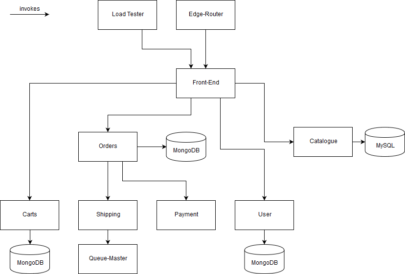

# Sock Shop

> <https://github.com/microservices-demo/microservices-demo>

**Size of the project:** ~12,000 SLoC

## Description

Sock Shop is an e-commerce website that sells socks. It is intended to aid the demonstration and testing of microservice and cloud native technologies. All services communicate using REST over HTTP. The Java services are implemented using Spring Boot, the services implented with Go use Go Kit instead.

## Services
- [Front-End](https://github.com/microservices-demo/front-end) (Node.js)

- [Catalogue](https://github.com/microservices-demo/catalogue) (Go)

- [Carts](https://github.com/microservices-demo/carts) (Java, Spring Boot)

- [Orders](https://github.com/microservices-demo/orders) (Java, Spring Boot)

- [Shipping](https://github.com/microservices-demo/shipping) (Java, Spring Boot)

- [Queue-Master](https://github.com/microservices-demo/queue-master) (Java, Spring Boot)

- [Payment](https://github.com/microservices-demo/payment) (Go)

- [User](https://github.com/microservices-demo/user) (Go)

- [Edge-Router](https://github.com/microservices-demo/edge-router) (Shell)

- [Load Test](https://github.com/microservices-demo/load-test) (Shell, Python)

## Architecture

